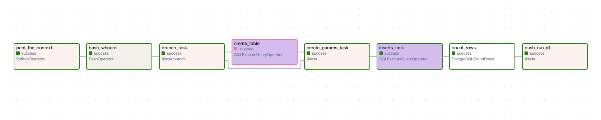
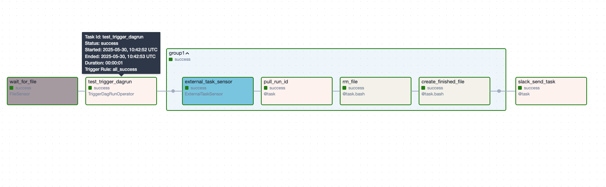
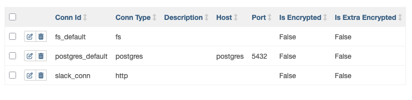

This repo contains two DAG files testing many features of Airflow.

The first one `dags/jobs_dag.py` creates three similar DAGs that insert rows into a Postgres DB.



The second one `test_zip/trigger_dag.py` creates a DAG that waits for the file `/tmp/run` to be created,
then triggers the first DAG, waits for it to finish, deletes the file and sends a Slack notification.




## Usage

Create a directory for Airflow (e.g. `~/airflow`)
and copy the file `docker-compose.yaml` there.

Modify the volume binding `- ${AIRFLOW_PROJ_DIR:-.}/dags:/opt/airflow/dags`
to point to the `./dags` directory from this repo.
E.g. `- /home/user/Airflow_Tutorial_Grid/dags:/opt/airflow/dags`.

Build and run the containers:
```sh
docker compose up
```

Set up the three connections as shown (the filesystem connection is expected to map to `/tmp`): 


### Running the trigger DAG

The DAG files for this DAG are in a separate directory to test Airflow's packaging feature.
The contents of `./test_zip` are zipped to `dags/trigger_dag.zip`.

The DAG expects a Slack token in the `slack_token` Variable.
It can be set like this (it doesn't persist across runs):
```sh
docker compose exec vault sh
vault login ZyrP7NtNw0hbLUqu7N3IlTdO
vault secrets enable -path=airflow -version=2 kv
vault kv put airflow/variables/slack_token value=YOUR_SLACK_TOKEN  # my token is stored in Connections
```

Trigger the DAG from the UI.

It will wait for the file `/tmp/run` to be created.
Since the FileSensor is deferred, both the worker and the triggerer containers need to see the file.
For this, we created a shared volume mapping `/tmp` to the `./tmp` directory inside `~/airflow`.
```sh
echo test > ~/airflow/tmp/run
```